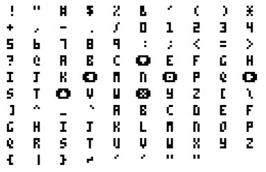

# pico-8-font
Faithful reproduction of the [PICO-8](http://www.lexaloffle.com/pico-8.php) font as TrueType and glyph. Both uppercase and lowercase letters appear as uppercase.

## Installation

### Mac OS X, Windows

Double-click the `PICO-8.ttf` file, then click "Install".

### Linux (Ubuntu, Mint)

Execute the following command, then click "Install": 

`gnome-font-viewer <path-to-font-file>`